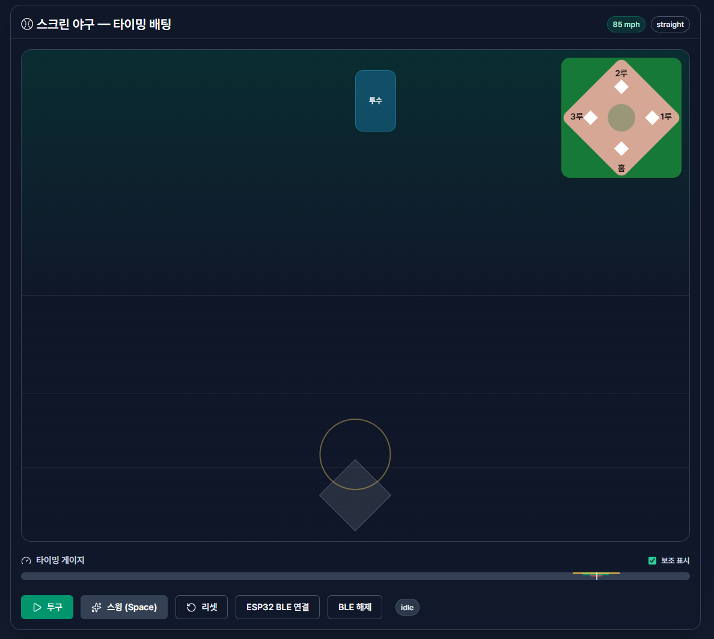

# ⚾️ Screen Baseball BLE (2025 학생회 축제)

> **ESP32 + BLE + React 기반 스크린 야구 타이밍 게임**  
> 실제 배트를 휘둘러 스윙 타이밍을 맞추는 체험형 게임 부스 프로젝트입니다.

---

## 📘 프로젝트 개요

| 항목 | 내용                                       |
|------|------------------------------------------|
| **프로젝트명** | Screen Baseball BLE                      |
| **목적** | BLE 배트를 활용한 인터랙티브 스크린 야구 부스 제작           |
| **핵심 아이디어** | ESP32 + MPU6050 센서를 부착한 무선 배트로 스윙 타이밍 감지 |
| **참여 행사** | 2025 경동대학교 학생회 축제 부스                     |
| **개발 기간** | 2025.09 ~ 2025.10                        |
| **개발 인원** | 1명                  |

---

## 🧠 주요 기능

- ⚾ **타이밍 배팅 모드** : 화면 투구 애니메이션에 맞춰 배트를 휘둘러 타격  
- 🔵 **BLE 실시간 스윙 감지** : ESP32가 `"SWING"` 신호를 전송하면 React 앱에서 인식  
- 🎯 **정확도 판정** : PERFECT / GOOD / OKAY / FOUL / STRIKE  
- 🧮 **점수 & 주자 시스템** : 안타·홈런 시 진루 및 득점 자동 계산  
- 💫 **애니메이션 효과** : Framer Motion을 활용한 부드러운 공 비행 및 타격 연출  
- ⚙️ **자동 투구 모드 (Auto Pitch)** : 연속 투구 시 자동 루프  
- 🧩 **BLE 상태 UI** : 연결 / 해제 / 장치명 / 수신 상태 표시  

---

## 🧱 폴더 구조

```
src/
├─ components/
│  ├─ field/               # 필드 및 공 애니메이션
│  │  └─ Field.tsx
│  ├─ hud/                 # 게임 HUD (UI)
│  │  ├─ Controls.tsx
│  │  ├─ Scoreboard.tsx
│  │  └─ TimingBar.tsx
│  ├─ ui/                  # shadcn/ui 기반 공용 컴포넌트
│  │  ├─ badge.tsx
│  │  ├─ button.tsx
│  │  ├─ card.tsx
│  │  └─ slider.tsx
│  └─ MiniDiamond.tsx      # 주자 상태 표시
│
├─ game/
│  ├─ engine/
│  │  └─ usePitchEngine.ts # 핵심 게임 로직 훅
│  ├─ constants.ts
│  ├─ types.ts
│  └─ utils.ts
│
├─ io/
│  └─ ble.ts               # BLE 연결 및 수신 처리 훅
│
├─ pages/
│  └─ ScreenBaseballTiming.tsx   # 전체 페이지 (메인 컴포넌트)
│
├─ types/
│  ├─ web-bluetooth.d.ts   # BLE 타입 정의
│  └─ ...
│
├─ index.html
└─ main.tsx
```

---

## ⚙️ 실행 방법

### 1️⃣ 의존성 설치
```bash
npm install
```

### 2️⃣ 개발 서버 실행
```bash
npm run dev
```

### 3️⃣ 접속
브라우저에서 [http://localhost:5173](http://localhost:5173) 접속

---

## 📡 BLE (Bluetooth Low Energy) 연결 방식

| 구분 | 값 |
|------|----|
| **Service UUID** | `6e400001-b5a3-f393-e0a9-e50e24dcca9e` |
| **Characteristic (TX)** | `6e400003-b5a3-f393-e0a9-e50e24dcca9e` |
| **수신 데이터 형식** | `"SWING"` (문자열) |
| **프로토콜** | GATT / Nordic UART Service (NUS) |
| **지연 보정** | `debounceMs: 250` |

### 🧾 데이터 흐름
1. ESP32 → BLE `"SWING"` 송신  
2. Web Bluetooth → `ble.ts`에서 수신  
3. `useBleSwing()` 훅이 이벤트 처리  
4. `doSwing()` 함수 실행 → 타격 판정 및 결과 표시  

---

## 💻 기술 스택

| 분류 | 사용 기술 |
|------|------------|
| **Frontend** | React 19, TypeScript, Vite |
| **UI** | Tailwind CSS, shadcn/ui, Framer Motion |
| **Hardware** | ESP32 (BLE), MPU6050 (가속도센서) |
| **Communication** | Web Bluetooth API |
| **Logic** | Custom Hook (`usePitchEngine`, `useBleSwing`) |
| **Animation** | Framer Motion 기반 실시간 인터랙션 |
| **Tooling** | PlatformIO, Arduino IDE (ESP32 빌드) |

---

## 🔩 주요 파일 요약

| 파일 | 역할 |
|------|------|
| `usePitchEngine.ts` | 게임 핵심 로직: 투구 루프, 판정, 점수 관리 |
| `ble.ts` | BLE 연결 및 수신 이벤트 처리 |
| `Field.tsx` | 공 이동/스케일 애니메이션 및 시각 효과 |
| `Controls.tsx` | 투구/스윙/리셋 및 BLE 제어 버튼 |
| `Scoreboard.tsx` | 점수, 스트라이크, 아웃 등 표시 |
| `TimingBar.tsx` | 스윙 타이밍 게이지 표시 |

---

## 🏗️ 시스템 동작 개요

```mermaid
flowchart TD
A[ESP32 + MPU6050] -->|SWING BLE 송신| B[Web Bluetooth API]
B --> C[useBleSwing 훅]
C --> D[doSwing() 호출]
D --> E[usePitchEngine 로직]
E --> F[결과 판정 및 애니메이션 렌더]
F --> G[Field / Scoreboard / TimingBar 업데이트]
```

---

## 🧩 하드웨어 구성

| 부품 | 용도 |
|------|------|
| **ESP32 DevKitC** | BLE 통신 및 연산 |
| **MPU6050** | 3축 가속도·자이로 센서 (스윙 감지) |
| **리튬 배터리 + 충전모듈** | 무선 사용 |
| **배트 본체** | 센서 및 보드 내장 |

---

## 🕹️ 조작법

| 조작 | 동작 |
|------|------|
| **Enter** | 투구 시작 |
| **Space** | 스윙 |
| **체크박스** | 자동 투구 (Auto Pitch) |
| **BLE 연결 버튼** | ESP32와 Bluetooth 연결 |

---

## 📸 스크린샷 (예시)

> 🎮 UI 레이아웃, 투구 애니메이션, 점수판 화면 등은 추후 첨부
> 

---


## 📜 라이선스

이 프로젝트는 **비영리·교육 목적(경동대학교 축제)** 으로 제작되었습니다.  
코드 일부는 자유롭게 참고 가능하나,  
상업적 이용은 **금지**됩니다.

---

> 🏷️ “타이밍이 맞으면 홈런! 실제 배트를 휘둘러 즐기는 스크린 야구 부스” ⚾️
